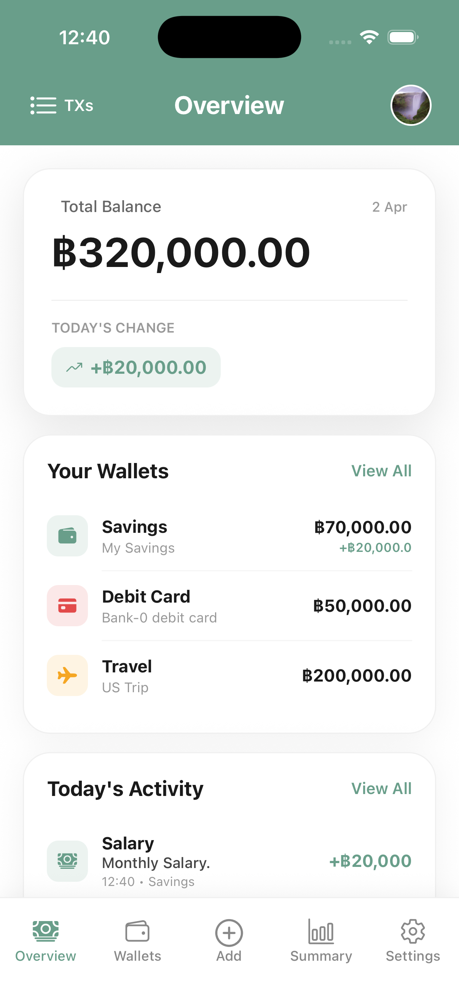
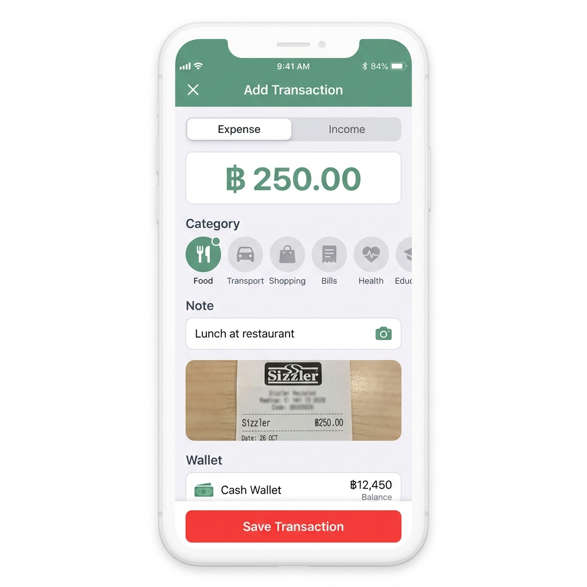
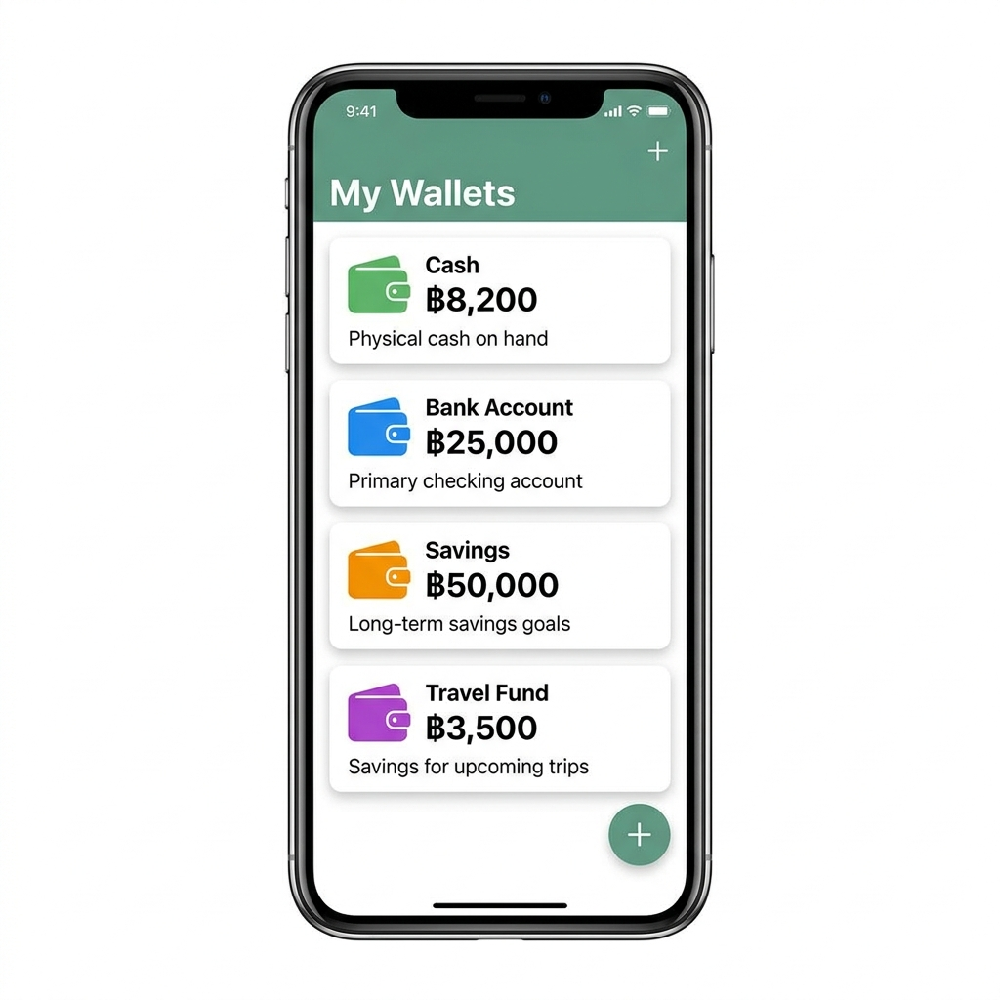
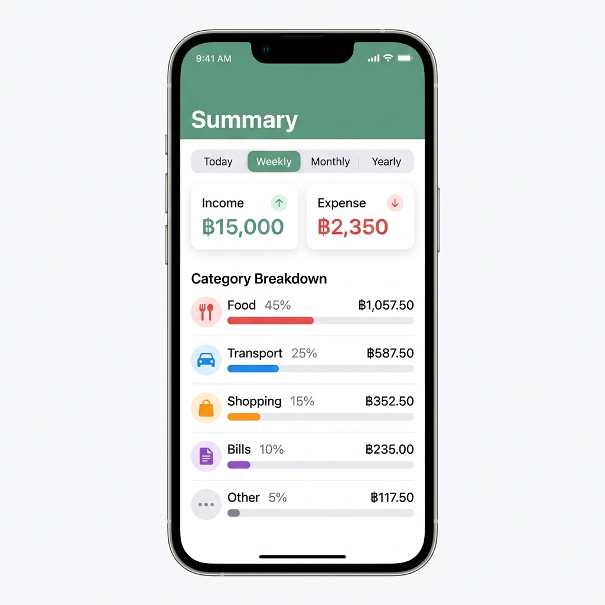

<p align="center">
  
</p>

<h1 align="center">Wallet+</h1>

<p align="center">
  <strong>A modern, feature-rich personal finance tracker built with React Native & Firebase</strong>
</p>

<p align="center">
  
  
  
  
</p>

<p align="center">
  
  
  
</p>

---

## Screenshots

<p align="center">
  
  &nbsp;&nbsp;
  
  &nbsp;&nbsp;
  
  &nbsp;&nbsp;
  
</p>

<p align="center">
  <em>Dashboard • Add Transaction • Wallets • Summary</em>
</p>

---

## Features

### Collaborative Multi-Wallet Management
- **Shared Wallets**: Join or invite others to collaborate on expense tracking via unique Wallet IDs.
- **Ownership Control**: Owners can manage collaborators, browse participants, and remove members.
- **Customization**: Personalize wallets with distinct icons, colors, and descriptions.
- **Real-time Sync**: Instant balance updates across all connected devices using Firebase.

### Advanced Transaction Tracking
- **Smart Logging**: Effortless entry for income and expenses with intelligent category mapping.
- **Rich Filtering**: Search and filter history by **amount range**, **category**, or **date frequency**.
- **Custom Date Ranges**: Flexible period filtering including Daily, Weekly, Monthly, Yearly, and Custom Range selections.
- **Image Attachments**: Securely attach photos of receipts, bills, or invoices to any transaction.
- **Contextual Notifications**: Real-time warnings for insufficient balance or negative starting amounts.

### Premium Experience & UX
- **Haptic Feedback System**: Tactical responses for all core interactions (toggling filters, submitting forms, deletions, and error validations).
- **Transaction Detail Modal**: Elegant full-screen previews with high-resolution image rendering and direct navigation to edit mode.
- **Smart Persistence**: Automatic login sessions and secure local caching for immediate data access.
- **Dynamic Onboarding**: Context-aware empty states and guidance for new users.

### Analytics & Summary
- **Visual Breakdown**: Dynamic charts and percentage-based category consumption bars.
- **Monthly Comparison**: Longitudinal trend analysis to track financial growth or spending patterns.
- **Period Synthesis**: Aggregated totals that calculate net changes over specific timeframes.

---

## Security & Privacy

The application follows a **Security-First** architecture:
- **Client-Side Keys**: Firebase API keys are deliberately included in the repository for "one-click" collaboration. Per Firebase security documentation, these are identifiers, not secrets.
- **Server-Side Security**: Data privacy is strictly enforced via **Cloud Firestore Security Rules**. Even with the API keys, no user can read or modify data that does not belong to them.
- **Authentication**: All features require a secure login via Firebase Authentication.

---

## Tech Stack

| Layer | Technology |
|---|---|
| **Framework** | [React Native](https://reactnative.dev/) 0.83 with [Expo](https://expo.dev/) 55 |
| **Language** | [TypeScript](https://www.typescriptlang.org/) 5.9 |
| **Navigation** | [Expo Router](https://docs.expo.dev/router/introduction/) (file-based routing) |
| **Backend** | [Firebase](https://firebase.google.com/) (Firestore + Auth) |
| **State** | React Hooks and Context API |
| **Haptics** | [expo-haptics](https://docs.expo.dev/versions/latest/sdk/haptics/) |
| **Icons** | [@expo/vector-icons](https://icons.expo.fyi/) (Ionicons) |
| **Persistence** | AsyncStorage & Firestore Persistence |

---

## Project Structure

```
wallet-plus/
├── app/
│   ├── (auth)/                     # Authentication screens
│   ├── (tabs)/                     # Main app navigation
│   │   ├── index.tsx               # Dashboard view
│   │   ├── wallet/                 # Wallet management
│   │   ├── transactions/           # Transaction history & editing
│   │   ├── summary/                # Analytics & reports
│   │   └── settings/               # User profile & preferences
│   └── _layout.tsx                 # Root layout & auth guards
├── components/                     # Shared UI components
├── constants/                      # Theme colors & category definitions
├── utils/
│   └── haptics.ts                  # Standardized haptic feedback logic
├── types/                          # TypeScript definitions
├── assets/                         # Static resources
└── firebaseConfig.ts               # Firebase initialization
```

---

## Getting Started

### Prerequisites

- [Node.js](https://nodejs.org/) (v18 or later)
- [npm](https://www.npmjs.com/) (v9 or later)
- [Expo Go](https://expo.dev/go) app for testing on physical devices

### Installation

1. **Clone the repository**
   ```bash
   git clone https://github.com/psrisuphan/wallet-plus.git
   cd wallet-plus
   ```

2. **Install dependencies**
   ```bash
   npm install
   ```

3. **Environment Setup**
   The project is pre-configured with the default Firebase project credentials. Ensure Firestore and Authentication are enabled in your Firebase console if you're using your own project.

4. **Launch Application**
   ```bash
   npx expo start
   ```

---

## Roadmap

- [x] Multi-wallet management
- [x] Transaction tracking with categories
- [x] Image note attachments for receipts
- [x] Financial summary with period filtering
- [x] Monthly comparison analytics
- [x] Transaction detail modal
- [x] Advanced transaction filtering (amount/date/category)
- [x] Shared wallets (collaboration via Wallet ID)
- [x] Premium haptic feedback system
- [ ] Dark mode support
- [ ] Budget goals & alerts
- [ ] Export transactions (CSV / PDF)
- [ ] Push notifications for spending limits
- [ ] Multi-currency support

---

## Contributing

This is currently a private project. If you'd like to contribute, please contact the repository owner to discuss your proposed changes.

---

## License

This project is private and not open-sourced. All rights reserved.

---

<p align="center">
  Built with passion for modern personal finance
</p>
